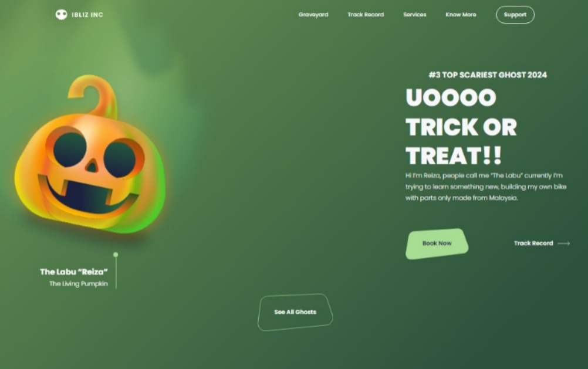

<h1 align="center">
  Landing Page: Labu - The Living Pumpkin 🎃
</h1>

## Sobre o Projeto

"Labu - The Living Pumpkin" é uma landing page desenvolvida com foco em responsividade e animações suaves, proporcionando uma experiência de usuário imersiva e adaptável a qualquer dispositivo, seja desktop ou móvel. O design moderno e interativo foi cuidadosamente criado para capturar a atenção do usuário, utilizando elementos visuais que enriquecem a navegação.



## Funcionalidades

- **Responsividade**: A página é completamente responsiva e se adapta a diferentes tamanhos de tela, desde desktops até dispositivos móveis.
- **Animações**: Utiliza animações CSS para dar vida aos elementos, como o movimento da abóbora na tela principal.
- **Design Moderno**: Utiliza a fonte "Poppins" para um visual limpo e moderno.

## Tecnologias Utilizadas

- **HTML5**: Estrutura da página.
- **CSS3**: Estilização e animações.
- **Google Fonts**: Fonte Poppins.

### Clone o repositório

```sh
git clone https://github.com/LucasSouza0101/Landing-page-halloween-1.git
```

### Diretório do projeto

```sh
cd Landing-page-halloween-1
```

## Contribuindo
Contribuições são bem-vindas! Sinta-se à vontade para abrir uma issue ou enviar um pull request para melhorias, correções ou novas funcionalidades.

## Licença
Este projeto está licenciado sob a licença MIT. Veja o arquivo LICENSE para mais detalhes.

```sh
Feito com ❤️ por Lucas.
```